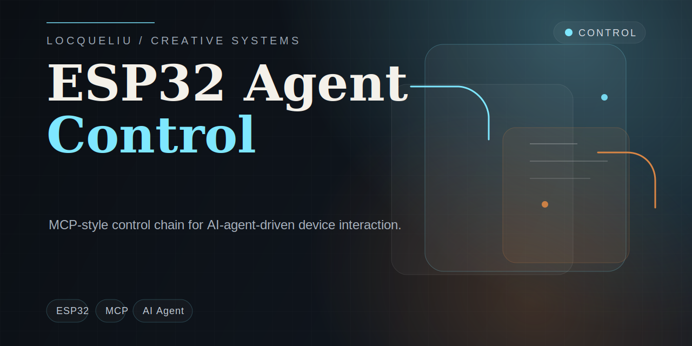

# esp32-agent-control-demo

[Chinese Version](./README_zh.md)

This repository is a compact control stack for AI-agent-driven ESP32 interaction.

I use it to think through the practical boundary between model-facing tools and device-facing commands: how an agent should call functions, how a bridge should normalize them, and how an ESP32 runtime should route them into screen, LED, servo, or motion behavior.

## Upstream reference

- Repository: [78/xiaozhi-esp32](https://github.com/78/xiaozhi-esp32)
- Description: `An MCP-based chatbot`
- License observed: `MIT`

The upstream project is an important reference because it already exposes device-side MCP control concepts. This repository keeps my smaller, easier-to-read version of that control path in the form of schemas, examples, and a runnable translator.

## What is inside

- an MCP-style tool catalog for device interaction
- a bridge script that translates `tools/call` payloads into compact device commands
- JSON schemas for commands and status reports
- clean-room firmware examples for routing commands on an ESP32 device

## Repository structure

- [`docs/upstream-reference.md`](./docs/upstream-reference.md) upstream context and repo boundary
- [`docs/architecture.md`](./docs/architecture.md) control flow from agent to device
- [`docs/tool-catalog.md`](./docs/tool-catalog.md) tool naming and parameter model
- [`schemas/device-command.schema.json`](./schemas/device-command.schema.json) command envelope
- [`schemas/device-status.schema.json`](./schemas/device-status.schema.json) status envelope
- [`examples/mcp`](./examples/mcp) MCP-style requests and responses
- [`examples/device`](./examples/device) translated device-side examples
- [`bridge/mcp_to_device_bridge.py`](./bridge/mcp_to_device_bridge.py) runnable translator
- [`firmware/command_router_example.cpp`](./firmware/command_router_example.cpp) command routing sketch
- [`firmware/tool_registry_example.cpp`](./firmware/tool_registry_example.cpp) compact tool registry example

## Core tools

- `self.motion.play`
- `self.screen.show`
- `self.led.set`
- `self.servo.set`

## Quick run

Translate one MCP-style payload:

```powershell
python .\bridge\mcp_to_device_bridge.py --input .\examples\mcp\tools.call.motion.play.json --pretty
```

Translate another payload:

```powershell
python .\bridge\mcp_to_device_bridge.py --input .\examples\mcp\tools.call.led.set.json
```

## Why I keep this repo

For me, the interesting part of ESP32 + AI Agent work is not only that a model can trigger hardware. The more important layer is the contract in the middle:

- stable tool names
- typed parameters
- safe argument ranges
- a bridge layer that can stay simple
- device routing that does not depend on LLM-specific logic

## Note

This repository stays focused on the control chain itself. The larger firmware branches and deployment-specific details belong elsewhere.
