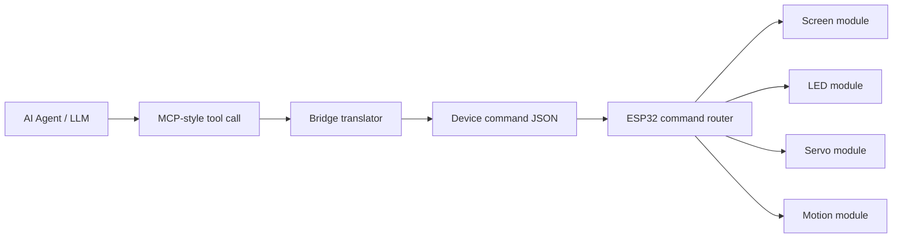

# esp32-agent-control-demo

Public-safe, clean-room demo for controlling ESP32 device capabilities from an AI agent through an MCP-style bridge.

## Upstream Reference

This repository is informed by experiments around the upstream project below:

- Upstream repository: [78/xiaozhi-esp32](https://github.com/78/xiaozhi-esp32)
- Upstream description: `An MCP-based chatbot`
- Upstream license observed: `MIT`

The upstream project explicitly supports device-side MCP control for device features such as speaker, LED, servo, GPIO, and screen-related operations. This repository does **not** re-upload upstream firmware or private local modifications. It is a public-safe demonstration repo containing original documentation, schemas, bridge examples, and clean-room firmware snippets.

## What This Repo Demonstrates

- how an AI agent can call device tools using an MCP-style `tools/call` payload
- how a bridge layer can translate those calls into compact device commands
- how an ESP32 runtime can route commands to `screen`, `led`, `servo`, and `motion` modules
- how to present embedded AI integration work publicly without exposing private services or code

## System View



## Repository Structure

- [`docs/upstream-reference.md`](./docs/upstream-reference.md): upstream attribution and publication boundary
- [`docs/architecture.md`](./docs/architecture.md): end-to-end control flow
- [`docs/tool-catalog.md`](./docs/tool-catalog.md): suggested tool naming and parameter model
- [`schemas/device-command.schema.json`](./schemas/device-command.schema.json): public-safe device command envelope
- [`schemas/device-status.schema.json`](./schemas/device-status.schema.json): status report envelope
- [`examples/mcp`](./examples/mcp): MCP-style input examples
- [`examples/device`](./examples/device): translated device command and status examples
- [`bridge/mcp_to_device_bridge.py`](./bridge/mcp_to_device_bridge.py): runnable bridge translator
- [`firmware/command_router_example.cpp`](./firmware/command_router_example.cpp): clean-room routing example for ESP32 firmware
- [`firmware/tool_registry_example.cpp`](./firmware/tool_registry_example.cpp): tool registration example aligned with this repo's schema
- [`NOTICE.md`](./NOTICE.md): attribution and publication note

## Tool Catalog Preview

This demo uses a small but realistic device tool surface:

- `self.motion.play`
- `self.screen.show`
- `self.led.set`
- `self.servo.set`

Example MCP-style request:

```json
{
  "jsonrpc": "2.0",
  "method": "tools/call",
  "params": {
    "name": "self.screen.show",
    "arguments": {
      "expression": "happy",
      "duration_ms": 1800
    }
  },
  "id": 2
}
```

Translated device command:

```json
{
  "device_id": "esp32-pet-01",
  "kind": "screen.show",
  "params": {
    "expression": "happy",
    "duration_ms": 1800
  }
}
```

## Quick Run

Translate one MCP-style payload into a device command:

```powershell
python .\bridge\mcp_to_device_bridge.py --input .\examples\mcp\tools.call.motion.play.json
```

Translate and pretty-print:

```powershell
python .\bridge\mcp_to_device_bridge.py --input .\examples\mcp\tools.call.led.set.json --pretty
```

## Why This Matters

For an ESP32 + AI Agent portfolio, the interesting part is not only that a model can "talk" to a device. The stronger engineering signal is:

- a stable tool naming convention
- a bridge contract between model-facing payloads and device-facing commands
- hardware-safe parameter boundaries
- clean separation between protocol, translation, and firmware behavior

## Public-Safe Note

This repository avoids:

- private branch code
- internal endpoint details
- real production keys or account pools
- direct redistribution of upstream firmware

It is designed to show integration thinking, protocol design, and embedded AI workflow architecture in a clean public form.
